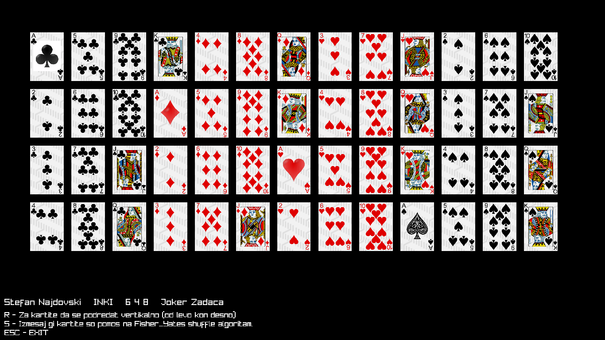

# Napredno Programiranje - Joker_Zadaca_karti_lab6

## Testrirano na Arch Linux/ macOS Ventura 13.3, bi trebalo da raboti i na Windows

### Podredeni:

### Izmeasni:


## Compile
```
sudo pacman -S g++ cmake raylib
```
- To compile the code:
```
g++ main.cpp -o main -lraylib
```
```
g++ main.cpp -o main -L/path/to/raylib -lraylib
```
ili koristi CLION (preku cmake kje se simni raylib)
